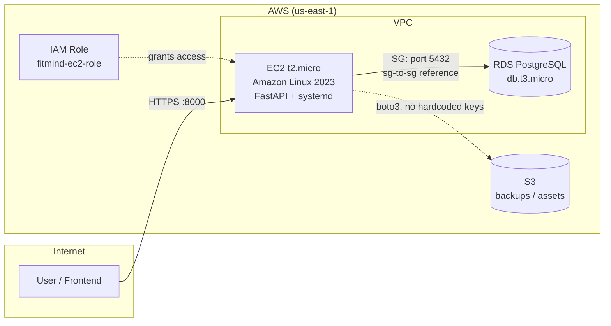

# FitMind AI — Backend

FastAPI backend for FitMind AI, a full-stack fitness and nutrition coaching app with LLM-powered guidance. Deployed on AWS using a hand-configured, production-style infrastructure setup (EC2, RDS, IAM, systemd) as a hands-on cloud engineering exercise.

## Architecture



## Stack

| Layer | Technology |
|---|---|
| API framework | FastAPI, Uvicorn |
| Database | PostgreSQL (AWS RDS) |
| ORM | SQLAlchemy |
| Auth | JWT (python-jose), passlib + bcrypt |
| AI integration | Groq API |
| Infra | AWS EC2, RDS, IAM, S3 |
| Process management | systemd |

## Infrastructure setup

This backend runs on a manually provisioned AWS environment rather than a managed PaaS, as a deliberate exercise in core cloud fundamentals before joining a clinical-trial infrastructure team.

**IAM**
- Root account secured with MFA; day-to-day access via a scoped IAM admin user (no root usage post-setup)
- `fitmind-ec2-role` — instance role granting EC2 access to RDS and S3 without hardcoded credentials

**RDS**
- Standard PostgreSQL (`db.t3.micro`, free-tier), not Aurora — chosen deliberately for cost and to learn standard RDS operations
- Not publicly accessible; reachable only from the application's EC2 security group via a security-group-to-security-group inbound rule (not IP-based), scoped to port 5432

**EC2**
- Amazon Linux 2023, Python 3.11 (upgraded from the system default 3.9 for dependency compatibility)
- App runs as a `systemd` service (`fitmind.service`) — persists across SSH sessions and auto-restarts on crash or reboot
- Security group scoped per-purpose: SSH restricted to a known IP, HTTP/HTTPS open, API port opened explicitly for testing

**Environment & secrets**
- Runtime config (`DATABASE_URL`, `JWT_SECRET_KEY`, `GROQ_API_KEY`) injected via `.env`, excluded from version control
- Database tables created automatically via SQLAlchemy metadata on app startup

## Notable debugging

- Diagnosed an EC2→RDS connection timeout down to a single misconfigured security group rule (`port 0` instead of `5432`) using the AWS CLI to inspect actual `IpPermissions`, after the console UI made the same issue when re-adding a rule silently
- Resolved a Python version mismatch (3.9 → 3.11) after dependency resolution failed on packages requiring Python 3.10+

## Local development

```bash
git clone https://github.com/Vishesh559/fitmind-backend.git
cd fitmind-backend
python3.11 -m venv venv
source venv/bin/activate
pip install -r requirements.txt
cp .env.example .env  # fill in DATABASE_URL, JWT_SECRET_KEY, GROQ_API_KEY
uvicorn main:app --reload
```

## API

| Route | Description |
|---|---|
| `GET /` | Health check |
| `/auth` | Authentication (JWT) |
| `/workouts` | Workout tracking |
| `/nutrition` | Nutrition tracking |
| `/ai` | LLM-powered coaching endpoints |

---

Frontend repo: [fitmind](https://github.com/Vishesh559/fitmind) (Next.js)
